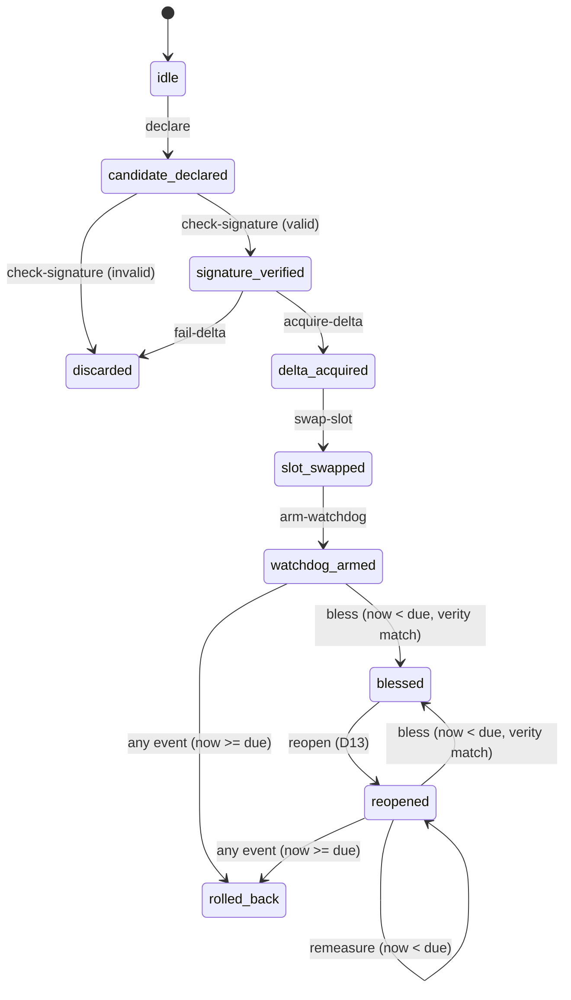

<!--
SPDX-FileCopyrightText: 2026 Lusoris <lusoris@proton.me>
SPDX-License-Identifier: CC-BY-SA-4.0
-->

# The P02 A/B candidate lifecycle and its transition trace

Status: recorded model from milestone M15, 2026-09-13

`build/repart.d` and `build/sysupdate.d` say what an A/B update *is*: two root
slots, a dm-verity hash partition, and one dual-slot transfer with
`InstancesMax=2` and a read-only target. `crates/aegis-fabrica-defs` reads those
files. This page records what `crates/aegis-janus-lifecycle` adds: what
*happens* to a candidate release as it moves through them, and the artefact
milestone M24 will diff a real QEMU transfer against.

Everything on this page is a model. Nothing in the crate runs
`systemd-sysupdate`, opens a device, computes a hash, verifies a signature,
changes a boot order or reboots, and a pass of its tests closes no image, boot,
hardware or release gate.

## The lifecycle



One machine models one candidate. A second candidate gets a second machine,
which is what keeps a trace about exactly one release. `rolled-back` and
`discarded` are terminal; `blessed` is not, because D13 chose reversible
consolidation.

Three properties hold the model to the repository's invariants:

- **The clock is a parameter.** `Machine::step` takes a `Clock` and reads it
  once per step, through a guard that refuses a clock that stepped backwards.
  `StubClock` is the only implementation the crate ships, and no module names
  `SystemTime`.
- **A transition allocates nothing.** Every value the machine holds is `Copy`
  and the trace is a fixed array of 32 records, so a step writes into storage
  that already exists. Rendering a trace to text does allocate, and is not the
  lifecycle path.
- **A refused step changes nothing.** Planning is separated from applying, so
  only an accepted plan is applied and recorded. The one exception is the
  monotonic guard: the clock was read, so it has observed that reading.

## The watchdog boundary

REQ-P02-08 says a hardware watchdog expiring before the bless signal triggers
an automatic A/B rollback. The watchdog is the half-open interval
`[armed_at, due_at)`, so expiry is `now >= due_at`: a tick exactly at the
timeout has expired and the tick before it has not. Equality expires because
that is the fail-closed reading; a watchdog that treated its own deadline as
still running would extend every timeout by one tick.

The expiry is a property of the deadline and not of the event that samples it.
An on-trial state reads the clock and evaluates the deadline *before* it
dispatches the event, so past `due_at` every offered event plans the same
rollback -- a `bless` included. The alternative, evaluating the deadline only
when a `tick` is offered, leaves the requirement satisfiable only by a
well-behaved driver: one that simply never sampled the clock could bless a
candidate whose watchdog expired long ago. The D13 maintenance window is
bounded the same way, so a `remeasure` cannot hold a closed window open
either. The forced rollback is recorded in the trace under the event that was
offered, because the trace records what happened rather than what was asked
for.

The boundary tests fork one machine and drive the copies at `due - 1`, `due`
and `due + 1`, so the runs differ in the clock reading and in nothing else.
There are three such forks: `tick` on the armed watchdog, `bless` on the armed
watchdog with no `tick` ever offered, and `bless` on a reopened maintenance
window, again with no `tick`. A fourth pair drives `tick` at `due - 1` and
`due` on a reopened window, and two negative tests show that a late `remeasure`
and an event the window would otherwise refuse both roll back rather than being
accepted or refused.

## D13 against the dm-verity requirement

REQ-P02-05 asks for reversible structural consolidation: a mature security
structure stays reopenable for bounded maintenance, so the system cannot lock
itself into an uncorrectable "false maturity" -- the same failure REQ-P16-05
names for P16 Athena's maturity gates. REQ-P02-01 asks that the read-only root
be bit-for-bit identical to the signed release before it is trusted. Reopening
a consolidated slot is exactly the operation that could break that, which is
what made D13 a decision rather than a detail.

**The reconciliation, one rule: reopening a blessed slot discards its dm-verity
measurement.** The slot can only be blessed again by presenting a fresh
measurement equal to the signed release's root hash. Reversibility costs a
re-verification; it never costs the integrity check. A re-bless with no fresh
measurement is refused as `VerityUnmeasured`, and one that differs by a single
nibble is refused as `VerityMismatch`.

`crates/aegis-janus-lifecycle/src/decision.rs` is the register: what was
decided, which requirements it reconciles, which dispute it closes (DSP-27) and
which private sources posed it, cited by export identifier and digest prefix.
The register admits and refuses nothing; the state machine next to it holds the
rule, and the tests tie the two together so the register cannot drift away from
the behaviour.

## The transition trace

The trace is the artefact M24 consumes. It is JSON Lines: one header line, then
one record per accepted transition, each line newline-terminated.

```json
{"schema":"aegis.p02.ab-transition.v1","record":"header","version":"1.4.0","target":"b","fallback":"a","expected-root-hash":"a1b2...","transitions":6}
{"schema":"aegis.p02.ab-transition.v1","record":"transition","seq":0,"at":1000,"event":"declare","from":"idle","to":"candidate-declared","slot":"b"}
```

Four properties make `expected.render() == observed_text` a sound test rather
than a coincidence:

| Property | How it is held |
| :--- | :--- |
| Ordered | Records carry a dense ascending `seq` from zero, enforced where records enter the trace rather than where they leave it |
| Self-describing | Every line carries the schema tag and a record kind; the header states the release, both slots and the signed root hash |
| Stable | Every value is an integer or one of the crate's own stable names: no floating point, no map ordering, no host timestamp, no free text. A release version that would need a JSON escape is refused rather than escaped |
| Complete | Every accepted step is recorded, including a tick that changed no state; a refused step records nothing, and the header's transition count makes a truncated trace a parse failure |

Rendering is a fixed point of `Trace::parse`: a trace read back and rendered
again is the same bytes. M24 may therefore compare in whichever direction it
holds the input for, and may also build a trace from an observed run and
compare it as a value.

The schema tag is versioned because the field order *is* the rendered form.
Changing a field name, a field order or a state name changes the bytes, and the
tag has to change with it.

One thing M24 has to supply, and this milestone deliberately does not: the tick
scale. `at` is read from the injected clock, whose origin is arbitrary and is
not the Unix epoch, because nothing here reads a host clock. A comparison
against a real run therefore drives the model with ticks taken from that run on
one agreed scale -- guest seconds since boot is the obvious choice -- rather
than expecting two independently produced traces to agree on absolute times.

## What is stubbed, and what a real implementation would do

`SysupdateCall` describes a call; holding one performs nothing.
`Machine::pending_call` says which call the current state needs next, so the
sequence of descriptions is a second artefact M24 can compare against.

| Call | What a real implementation would do |
| :--- | :--- |
| `list` | `systemd-sysupdate --definitions=<dir> list`, the invocation the M03 gate already runs offline |
| `verify` | check the release signature; see the open point below |
| `update` | `systemd-sysupdate --definitions=<dir> update <version>`, which writes the alternate slot |
| `swap-slot` | set the `TriesLeft=`/`TriesDone=` partition flags the transfer's `[Target]` section defines |
| `bless-boot` | `systemd-bless-boot good` |
| `rollback-boot` | `systemd-bless-boot bad` |

That the calls are stubbed is checked, not promised: `tests/stubbed_effects.rs`
sweeps the crate's own sources, comments stripped, for twenty recorded
identifiers -- ways to start a process, open a file or device, read the host
clock, consult the environment, reach a socket, a path or a thread, pull a file
in at compile time, or step outside safe Rust -- and fails if one appears. The
manifest is checked too, because the sweep cannot see through a dependency: the
crate depends on four pinned workspace crates and declares no binary and no
build script.

The list is an enumeration and not a quantifier, and the difference matters. It
is not "every identifier through which the host could be reached", because no
list of identifiers is that: an identifier nobody wrote down is not swept for.
The M15 verification demonstrated exactly that, planting `option_env!`,
`std::path::Path::new(..).exists()`,
`std::os::unix::net::UnixStream::connect(..)`, `std::io::Write::flush` and
`std::thread::current()` past a list that then held fourteen tokens and
watching the sweep pass. Those five are on the list now, which says nothing
about the sixth. What the sweep is, correctly stated, is a regression gate over
the reaches this crate is known to have had or been shown to be open to,
resting on a structural argument for why the remaining surface is small: no
`unsafe` anywhere (the workspace forbids it), no `libc`, no binary, no build
script, and four pinned dependencies.

**Open point, not settled here.** `sysupdate.d(5)` defines a `Verify=` key in
`[Transfer]`, and the reviewed `build/sysupdate.d/10-root.transfer` does not set
it: the file carries `ProtectVersion=` only. The crate models the signature
stage because REQ-P02-01 requires it, and does not claim the reviewed
definition performs it. Which key carries the release signature, and against
which trust store, is work for a milestone with a real signed artefact.

## Scope

A pure state machine with stubbed effects. No image is built, nothing boots,
and no real A/B swap, slot write, signature check, dm-verity computation or
reboot happens; no TPM is touched and no device is opened. P02
`aegis-janus-vallum` stays a proposal in `planning/components.json`: this crate
models the lifecycle and is not the component daemon, and P02's activation
blockers are image, kernel, boot and hardware evidence this milestone produces
none of.
